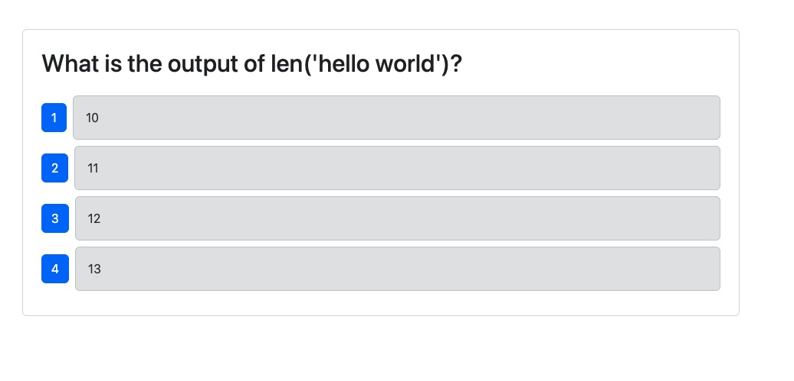
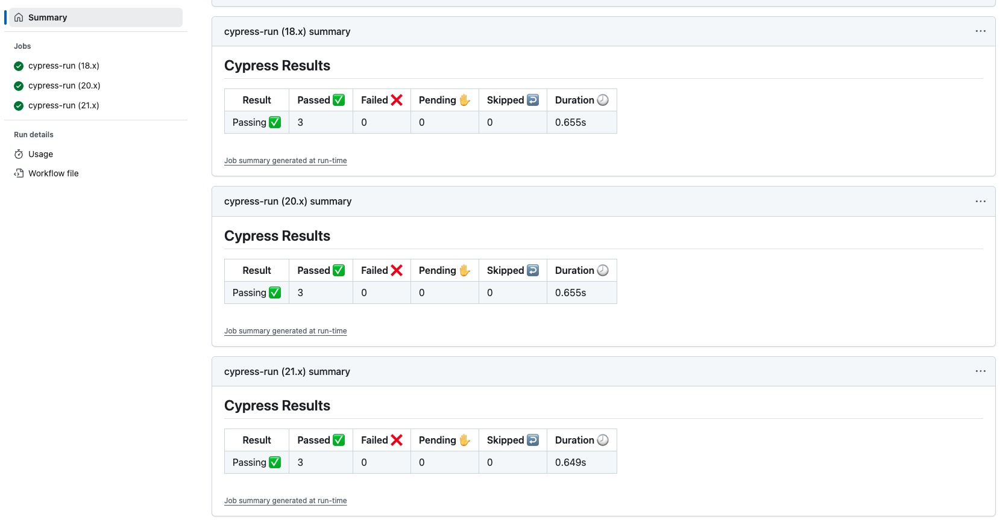
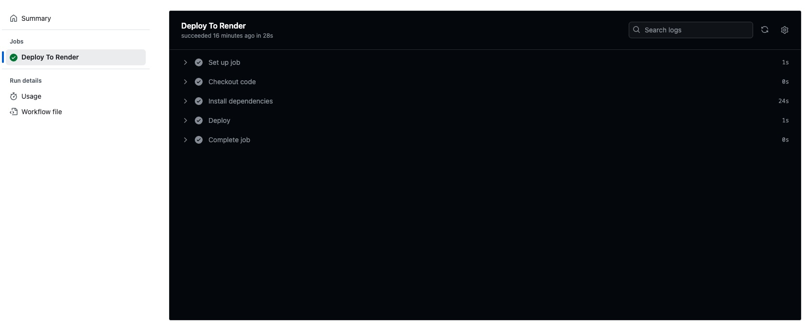

# Project20-GitHubActions-CI/CD

## Description
This is a full-stack application that utilizes a CI/CD pipeline through GitHub Actions. The GitHub Actions run component tests via Cypress when a Pull Request is made to the develop branch from a user's feature branch. They also deploy the application to Render when a Pull Request is closed, and code is merged, from the develop branch into the main branch.

## Table of Contents
1. [Installation](#installation)
2. [Usage](#usage)
3. [Contributing](#contributing)
4. [Tests](#tests)
5. [License](#license)
6. [Questions](#questions)

## Installation
To install the application locally, do the following in your terminal:

1. Clone the repository to your local computer.  
   `git clone git@github.com:lwebert/Challenge-20-CICD-GitHubActions.git`
2. Check that node.js is installed.  
   `node -v`
3. Install dependencies.  
   `npm i`

## Usage
The application is deployed to Render at this [link](https://challenge-20-cicd-githubactions.onrender.com).

To run the application locally, open an instance of the application in your terminal. 
Run the following:
1. `npm run build`.
2. `npm run seed`. 
3. `npm run start`. 
4. Open the link [localhost:3001](localhost:3001).

To see the GitHub Actions in work, see the [Contributing](#contributing) section.

## Contributing
This application was developed by Lauren Webert. Here are some guidelines on ways to contribute:

Report a bug fix.

1. Create a new Issue in the GitHub repo.

Make local changes to push up.

1. Create a new feature branch (`git checkout -b <your-feature-branch-name>`)
2. Make your changes locally
3. Push the code back to the GitHub repo (`git push origin <your-feature-branch-name>`)
4. Create a pull request to the develop branch
5. See the GitHub Actions run through the Cypress Component test
6. Once approved, merge your code to the develop branch

Add to the deployed application.

1. Once your code has been approved and merged into the develop branch, create a new Pull Request from the develop branch to the main branch.
2. If no merge conflicts appear, and if your PR has been approved, merge the code to the main branch.
3. Got to the Actions tab to see it being deployed to Render via the deploy hook.

## Tests
The CI/CD pipeline is working correctly if the user is able to create PRs from their feature branch to the develop branch, and the Cypress component test is triggered and passes. The user is also able to create a PR from the develop branch to the main branch, and once approved and merged, it will trigger another GitHub Action that deploys the updated code to Render.

## License
The application is covered under [Apache License 2.0](https://www.apache.org/licenses/LICENSE-2.0.txt).   
https://www.apache.org/licenses/LICENSE-2.0.txt

## Questions
- GitHub username: [lwebert](https://github.com/lwebert).
- Reach me at [lauren@weberts.org](lauren@weberts.org) with additional questions.
